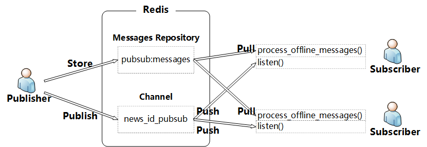
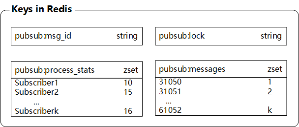

### Durable Redis `pubsub`

As we know, the `pubsub` in Redis could NOT store the messages published(i.e. w/o durability). So, when the subscriber is offline, it will miss all the messages during this offline period.  
In order to receive the messages published during the offline period when the subscriber is online, I referred to the [code](https://github.com/josiahcarlson/redis-in-action/blob/master/python/ch06_listing_source.py) on ["Redis IN ACTION"](https://www.amazon.cn/%E5%9B%BE%E4%B9%A6/dp/B016YLS2LM/ref=sr_1_1?ie=UTF8&qid=1507280512&sr=8-1&keywords=redis+in+action) and designed a **Naive** mechanism which has the following features(good and bad):

+ **All messages are stored and processed in an incremental order(the key and the restriction)**.
+ When subscriber is online, it processed the historical(offline) messages firstly, then listen on the pubsub channel.
+ Support multiple subscribers.
+ Unless **ensuring that all messages are processed in order**, this mechanism could **NOT** support multiple threads/processes.
+ Automatically removing the messages that have been received and processed by all subscribers.

The architecture of the mechanism is as follows.  
  
The keys in Redis is as follows.  

### NOTE
For some reason, this mechanism is implemented by `Python2.7` instead of `Python 3.6+`.  
requirements: `redis==2.10.5`

